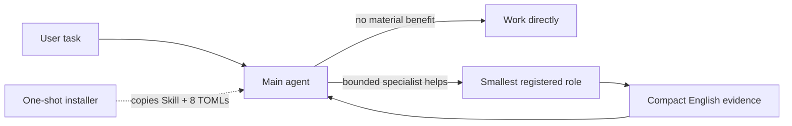

# Govern Agent System

Experimental v0.2.0 packages a concise Codex Skill and eight self-contained custom agents for native delegation. Ordinary runtime use has no Python governance controller, request JSON, generated profile, reuse token, ledger write, project overlay, or mandatory MCP step.

## Why v0.2 is simpler

Codex already knows how to select and spawn registered agents. v0.2 keeps policy where it is consumed:

- `SKILL.md` gives a capable main agent high-freedom selection and handoff guidance.
- `.codex/agents/*.toml` directly package the eight fixed roles with their complete execution, tool, escalation, model, effort, and sandbox contracts.
- project facts stay in each project's `AGENTS.md`.
- installer and rollback complexity remains a maintainer concern, outside the runtime prompt path.



## Role matrix

| Role | Model | Effort | Sandbox | Purpose |
|---|---|---|---|---|
| `default` | `gpt-5.6-terra` | high | read-only | Explicit general advisory fallback |
| `worker` | `gpt-5.6-terra` | high | workspace-write | Settled implementation slice |
| `explorer` | `gpt-5.6-terra` | high | read-only | Bounded discovery or triage |
| `code_locator` | `gpt-5.3-codex-spark` | high | read-only | Revision-aware factual locations |
| `cross_module_architect` | `gpt-5.6-sol` | high | read-only | Cross-module contracts and migration design |
| `systems_safety` | `gpt-5.6-sol` | high | workspace-write | Concurrency, lifecycle, crypto, authorization, persistence |
| `semantic_reviewer` | `gpt-5.6-sol` | high | read-only | Final semantic and security review |
| `release_operator` | `gpt-5.6-sol` | high | workspace-write | Approved revision-bound release work |

The dispatch-only, unvalidated `mechanical_luna` variant from v0.1 is removed; it was never a ninth role.

## Quick Start

Review the pending state without mutation, install, then restart Codex so the custom-agent registry is reloaded:

```bash
python3 scripts/install.py check
python3 scripts/install.py install
```

The installer copies only `SKILL.md` to `$HOME/.agents/skills/govern-agent-system/`, copies exactly eight packaged TOMLs to `${CODEX_HOME:-$HOME/.codex}/agents/`, and safely merges only these supported global settings:

```toml
[agents]
max_threads = 4
max_depth = 1
```

Standalone custom-agent TOMLs under `~/.codex/agents/` are discovered natively; no `config_file` declarations are required. The supported `[agents]` table contains settings such as `max_threads`, `max_depth`, `job_max_runtime_seconds`, and `interrupt_message`—it does not have an `enabled` switch. See the current [Codex Subagents documentation](https://developers.openai.com/codex/subagents/).

Other Codex configuration, including unrelated supported `[agents]` keys and MCP configuration, is preserved. Invoke `$govern-agent-system`; the main agent decides whether delegation materially helps, selects the smallest role, sends a minimal English assignment, and reuses the same child agent id on follow-up to the same surface. A refusal or failed safety gate is `STOP`, not permission to widen scope or elevate authority.

## Safe update and rollback

Every install creates a private snapshot and returns its path. Restore it with:

```bash
python3 scripts/install.py rollback --snapshot <snapshot-path>
```

The standard-library installer uses a contained no-follow lock, collision checks, content-bound manifests, complete pre-install snapshots, staged atomic replacement, recovery fencing, and exact destination rollback. It rejects unknown managed-state entries, symlinks/reparse points, hard-linked sensitive files, malformed manifests, ambiguous dotted `[agents]` keys, and changed managed content. POSIX state/snapshot directories are restricted to `0700`; sensitive files are `0600`. `check` is read-only. No install, check, or rollback command modifies MCP configuration.

Released managed v0.1.0, v0.1.1, and v0.1.2 copy or link installations can update to v0.2.0 after their recorded provenance is verified. The update replaces the managed Skill and eight adapters, removes controller/catalog artifacts from the installed Skill, and removes only the legacy installer-owned `enabled = true` entry from the real `[agents]` table. It preserves non-agent configuration, unrelated supported `[agents]` keys, MCP settings, and unknown user files outside managed destinations, and leaves any legacy `ledger.jsonl` bytes inert. Unknown versions and unproven or ambiguous `agents.enabled` fail closed. The v0.2 runtime never reads or writes the ledger as telemetry. The update snapshot restores the legacy configuration byte-for-byte, including `enabled = true`; legacy linked Skills are accepted only as verified migration inputs because v0.2 no longer offers `install --link`.

If recovery cannot be verified, managed writes remain fenced. Use only the exact recovery command and snapshot reported by the installer; do not delete the journal manually.

## Runtime and maintainer boundary

Runtime payload:

- one concise `SKILL.md`;
- eight canonical, parseable, self-contained custom-agent TOMLs;
- no controller, generator, overlay, telemetry, or MCP dependency.

Maintainer surface:

- `scripts/install.py` and `scripts/managed_lock.py` for check/install/rollback;
- tests for migration, rollback, collision, recovery, locks, permissions, links/reparse points, hard links, config merge, and static runtime contracts;
- public documentation and release metadata.

Code locator is portable with Git, `rg` when available, a bounded standard-library fallback, and verified line reads. CodeGraph or another MCP index is optional and non-blocking. Adapters may use relevant host-provided Skills or MCP tools when available, but they neither install nor require them.

## Experimental compatibility and evidence

v0.2.0 targets current Codex custom-agent TOML fields and native agent spawning on Sol/Terra high-or-greater main agents. These interfaces may change. Validate in an isolated `HOME`/`CODEX_HOME`, retain the returned snapshot, and restart Codex after installation.

The local suite exercises deterministic filesystem and configuration behavior on supported Python versions and CI operating systems. It does not prove model quality, cost reduction, faster completion, CodeGraph availability, production release safety, or superior outcomes from live multi-agent use. No controlled field study or production deployment claim is made.

## Development

```bash
python3 -m unittest discover -s tests -v
python3 -m compileall -q scripts tests
```

The project uses only the Python standard library. See [CONTRIBUTING.md](CONTRIBUTING.md) and [SECURITY.md](SECURITY.md).
