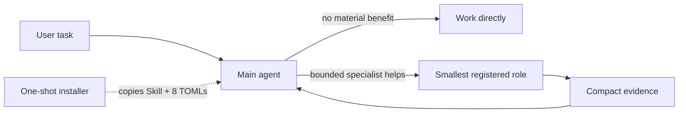

# Govern Agent System

[简体中文](README.zh-CN.md)

Experimental v0.2.3 packages a concise Codex Skill and eight self-contained custom agents for native delegation. Ordinary runtime use has no Python governance controller, request JSON, generated profile, reuse token, ledger write, project overlay, or mandatory MCP step.

## Why v0.2 is simpler

Codex already knows how to select and spawn registered agents. v0.2 keeps policy where it is consumed:

- `SKILL.md` gives a capable main agent high-freedom selection and handoff guidance.
- `.codex/agents/*.toml` directly package the eight fixed roles with their complete execution, tool, escalation, model, effort, and sandbox contracts.
- project facts stay in each project's `AGENTS.md`.
- installer and rollback complexity remains a maintainer concern, outside the runtime prompt path.



## Role matrix

| Role | Model | Effort | Sandbox | Purpose |
|---|---|---|---|---|
| `default` | `gpt-5.6-luna` | high | read-only | Bounded advisory node |
| `worker` | `gpt-5.6-luna` | high | workspace-write | Settled implementation node |
| `explorer` | `gpt-5.6-luna` | high | read-only | Bounded evidence collection or triage |
| `code_locator` | `gpt-5.3-codex-spark` | high | read-only | Revision-aware factual locations |
| `cross_module_architect` | `gpt-5.6-terra` | medium | read-only | Contract evidence and candidate options |
| `systems_safety` | `gpt-5.6-terra` | medium | workspace-write | Parent-approved safety invariant or patch |
| `semantic_reviewer` | `gpt-5.6-sol` | medium | read-only | Advisory semantic and security review |
| `release_operator` | `gpt-5.6-terra` | medium | workspace-write | Approved revision-bound runbook |

The old dispatch-only `mechanical_luna` variant remains removed. Luna is assigned directly to three existing routine roles; repeated reasoning failure escalates the same role to Terra instead of creating another role.

## Quick Start

Review the pending state without mutation, install, then restart Codex so the custom-agent registry is reloaded:

```bash
python3 scripts/install.py check
python3 scripts/install.py install
```

The same canonical installer is exposed as the `codex-agent-governance` Python command. From a checkout, `uvx --from . codex-agent-governance install` builds and runs it in an isolated environment. After the distribution is published, one command fetches the latest CLI and installs or upgrades the managed runtime:

```bash
uvx codex-agent-governance@latest install
```

For a persistent command, use `uv tool install codex-agent-governance`; refresh it with `uv tool upgrade codex-agent-governance`, then run `codex-agent-governance install`. `uvx` uses an ephemeral tool environment and `uv tool install` creates a persistent one, as documented in the [official uv tools guide](https://docs.astral.sh/uv/guides/tools/). The package metadata and wheel payload are present in this repository, but the distribution is not claimed to be on PyPI until a release is actually published.

The installer copies only `SKILL.md` to `$HOME/.agents/skills/govern-agent-system/`, copies exactly eight packaged TOMLs to `${CODEX_HOME:-$HOME/.codex}/agents/`, and safely merges only these supported global settings:

```toml
[agents]
max_threads = 6
max_depth = 1
```

Standalone custom-agent TOMLs under `~/.codex/agents/` are discovered natively; no `config_file` declarations are required. The supported `[agents]` table contains settings such as `max_threads`, `max_depth`, `job_max_runtime_seconds`, and `interrupt_message`—it does not have an `enabled` switch. See the current [Codex Subagents documentation](https://developers.openai.com/codex/subagents/).

Other Codex configuration, including unrelated supported `[agents]` keys and MCP configuration, is preserved. Six concurrent child threads match the current Codex default; `max_depth = 1` prevents recursive fan-out. Invoke `$govern-agent-system`; the main agent decides whether delegation materially helps, keeps one child by default, selects the smallest role for a frozen node, sends a minimal assignment, and reuses the same child agent id on follow-up to the same surface. The main agent owns architecture and product decisions, risk acceptance, integration, and final acceptance. A refusal or failed safety gate is `STOP`, not permission to widen scope or elevate authority.

Codex should load this Skill before spawning or reusing a native custom agent, even when the user does not name it. The automatic trigger covers two or more independent work surfaces, multi-repository or cross-module work, parallel coordination, and accumulated review or release work. Loading is not permission to delegate: the main agent still applies the dispatchability gate and works directly when no bounded specialist materially helps.

Native delegation is an optimization rather than a runtime prerequisite. When a Codex surface does not expose native spawn/reuse tools, the main agent continues directly under its existing authority and writer lease. Missing optional delegation capability must not be reported as a blocker, retried as a capability audit, or used to mark an otherwise actionable goal `blocked`.

Custom-agent registration can be task-local. If a spawn returns `unknown agent_type`, do not repeatedly retry it or infer that the adapter TOML is invalid: treat that role as unavailable to the current task, continue with a direct or already-registered smallest-fit path, and preserve the frozen node. Restarting Codex reloads the registry for fresh top-level tasks; an existing task can retain its earlier role set.

Inspect the actual spawn schema before delegating. When it exposes `agent_type`, every native spawn passes the selected registered role there; a task name containing `worker`, `locator`, or `review` does not bind the adapter. Ordinary role-bound spawns omit direct model/effort overrides and use `fork_turns="none"` or a small positive history count, because an omitted/`all` full-history fork inherits the parent model and effort.

Some existing task surfaces omit `agent_type` while still exposing `model` and `reasoning_effort`. In that compatibility mode, pass the fixed profile explicitly instead of inheriting the parent: Spark/high for `code_locator`; Luna/high for `default`, `worker`, and `explorer`; Terra/medium for `cross_module_architect`, `systems_safety`, and `release_operator`; Sol/medium for `semantic_reviewer`. This is a compatibility exception, not an escalation. The TOML sandbox and developer profile are not loaded in this mode, so read-only labels are advisory and the parent must retain the writer lease and verify the frozen owned scope. If the exact profile is unsupported, continue directly; do not silently inherit or choose a higher model. Existing children cannot be rebound mid-node, so let a mature bounded node finish and apply this rule to future nodes. This is internal dispatch discipline, not user-facing binding telemetry.

## Dispatch discipline

Describe each delegated node precisely enough to be independently verifiable. A dispatchable task has one observable state transition or one evidence question, one owner repository/worktree and baseline revision, a bounded file/symbol allowlist (or narrow search area), explicit exclusions, a frozen invariant, one operation class, and focused acceptance evidence. Background project context is not scope.

Split work before delegation when it mixes discovery, architecture, implementation, review, or release; crosses independent state machines; or bundles a migration, protocol version, runtime change, and client integration. Prefer `map → freeze → implement one node → verify/review`. One active writer owns a worktree/file set; readers use an immutable revision or finish before the writer changes their evidence base.

Every non-locator child report ends with `COMPLETE`, `PARTIAL`, or `STOP`, the inspected/changed scope, resulting revision/state when relevant, verification performed or not performed, blocker, and next parent action. `code_locator` instead ends with its exact `Lookup` status. Reuse a child only while repository/worktree, baseline, objective/invariant, operation class, and owned surface remain unchanged. A refusal, failed safety gate, missing authority, or external blocker remains `STOP`; otherwise, if the same child returns `PARTIAL` or a scope/ambiguity `STOP` twice in succession, first reduce the owned scope and/or clarify the objective, invariant, and expected result. Only a re-bounded task that still fails for reasoning quality may move one supported model or reasoning level higher. Luna-backed roles move to Terra without adding another role. Never enlarge the task while raising capability. Reserve the highest-cost reviewer for a frozen high-risk diff.

## Safe update and rollback

### Upgrade an existing managed installation

From a v0.2.3 checkout or release directory, use the new installer rather than manually copying files into the installed locations:

```bash
python3 scripts/install.py check
python3 scripts/install.py install
```

`install` directly replaces any verified current-format managed installation, including skipped-version updates and a source whose release number is higher than this installer. Version ordering is not a compatibility gate: the exact manifest schema, canonical destinations, content hashes, and managed config provenance are. Before replacement the installer snapshots the existing managed Skill, eight adapters, and managed configuration, then atomically replaces only those managed files. Record the returned snapshot path, then restart Codex to reload the custom-agent registry. Do not manually overwrite `$HOME/.agents/skills/govern-agent-system/` or `${CODEX_HOME:-$HOME/.codex}/agents/*.toml`.

Every install creates a private snapshot and returns its path. Restore it with:

```bash
python3 scripts/install.py rollback --snapshot <snapshot-path>
```

To remove the verified managed installation while preserving user-owned agents, unrelated Codex configuration, and MCP settings:

```bash
python3 scripts/install.py uninstall
```

`uninstall` also creates and returns a private rollback snapshot. It removes only the manifest-proven Skill, eight managed adapter files, `agents.max_threads`, `agents.max_depth`, and the managed manifest. If a later release changes the manifest/config schema and the current CLI cannot validate it, use a CLI version compatible with the installed schema to run `uninstall`, then run the newest CLI's `install`. An installer never guesses ownership from an unknown format.

The standard-library installer uses a contained no-follow lock, collision checks, content-bound manifests, complete pre-install snapshots, staged atomic replacement, recovery fencing, and exact destination rollback. Every replacement plan is durably journaled before mutation. After an interrupted journaled transaction, the next writer reports `RECOVERY_REQUIRED` with the exact `rollback --recover --snapshot ...` command; explicit recovery removes recorded transaction debris after exact restoration. If process death leaves a lock before journal creation or after journal close, the next writer reclaims it only after proving its owner is dead, acquires a replacement lock, rechecks the journal, and cleans only the reserved `.govern-agent-system.*` staging namespace. Live or ambiguous lock ownership remains fenced. It rejects unknown managed-state entries, symlinks/reparse points, hard-linked sensitive files, malformed manifests, ambiguous dotted `[agents]` keys, and changed managed content. POSIX state/snapshot directories are restricted to `0700`; sensitive files are `0600`. `check` is read-only. No install, check, uninstall, or rollback command modifies MCP configuration.

Any verified managed installation using the current format introduced at v0.2.0 can update directly to v0.2.3, regardless of skipped releases or whether its recorded release number sorts below, equal to, or above this CLI. Compatibility comes from the exact validated manifest/config format and provenance, not a fixed version list or version ordering. The update replaces the managed Skill and eight adapters with the fixed-profile runtime while preserving non-agent configuration, unrelated supported `[agents]` keys, MCP settings, and unknown user files outside managed destinations. Pre-v0.2 managed formats and any unknown schema fail closed without mutation; no v0.1 migration path is retained. The v0.2 runtime never reads or writes an inert legacy ledger as telemetry. Update and uninstall snapshots can restore the prior managed state byte-for-byte; v0.2 does not offer `install --link`.

If recovery cannot be verified, managed writes remain fenced. Use only the exact recovery command and snapshot reported by the installer; do not delete the journal manually.

## Runtime and maintainer boundary

Runtime payload:

- one concise `SKILL.md`;
- eight canonical, parseable, self-contained custom-agent TOMLs;
- no controller, generator, overlay, telemetry, or MCP dependency.

Maintainer surface:

- `scripts/install.py` and `scripts/managed_lock.py` for check/install/uninstall/rollback;
- tests for format compatibility, uninstall, rollback, collision, recovery, locks, permissions, links/reparse points, hard links, config merge, and static runtime contracts;
- public documentation and release metadata.

Code locator is portable with Git, `rg` when available, a bounded standard-library fallback, and verified line reads. CodeGraph or another MCP index is optional and non-blocking. Adapters may use relevant host-provided Skills or MCP tools when available, but they neither install nor require them.

## Experimental compatibility and evidence

v0.2.3 targets current Codex custom-agent TOML fields and native role-bound spawning from any capable high-or-greater main model, or an explicit user request to use the Skill. On legacy task surfaces that omit `agent_type`, it uses the documented explicit-profile compatibility path rather than pretending a TOML adapter was bound. These interfaces may change. Validate in an isolated `HOME`/`CODEX_HOME`, retain the returned snapshot, and restart Codex after installation.

The local suite exercises deterministic filesystem and configuration behavior on supported Python versions and CI operating systems. It does not prove model quality, cost reduction, faster completion, CodeGraph availability, production release safety, or superior outcomes from live multi-agent use. No controlled field study or production deployment claim is made.

## Development

```bash
python3 -m unittest discover -s tests -v
python3 -m compileall -q scripts src tests
```

The runtime and installed CLI use only the Python standard library; setuptools and wheel are build-time dependencies. See [CONTRIBUTING.md](CONTRIBUTING.md) and [SECURITY.md](SECURITY.md).
