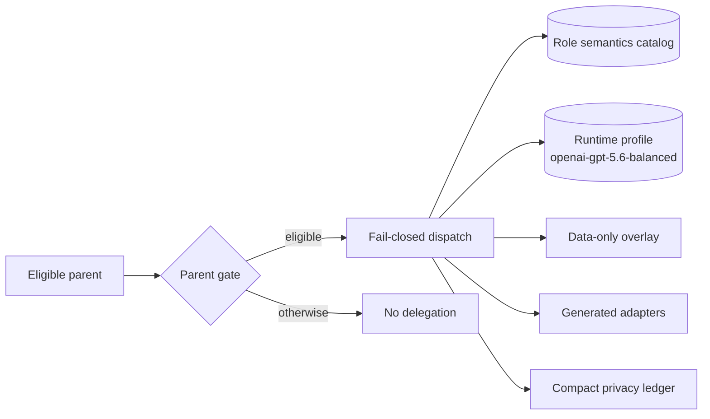
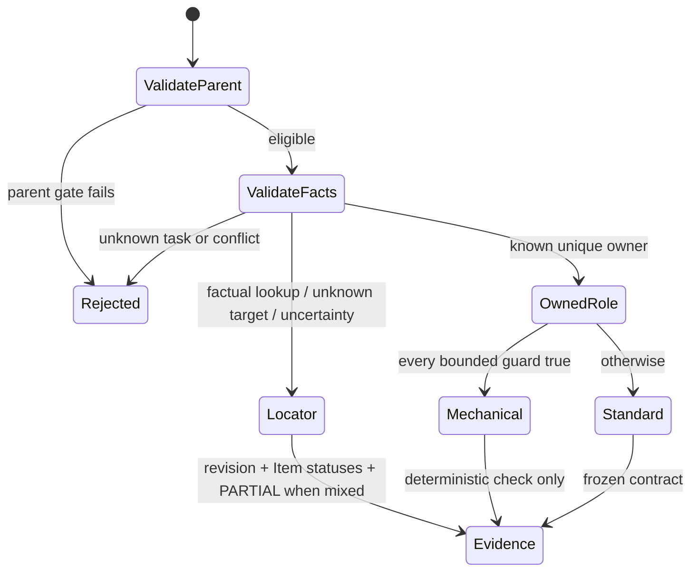
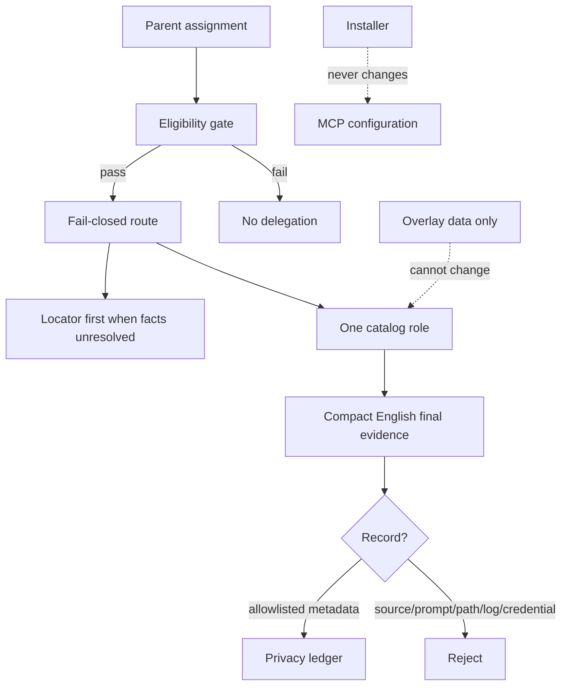
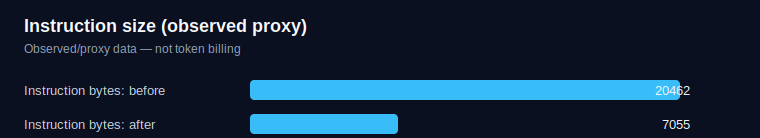
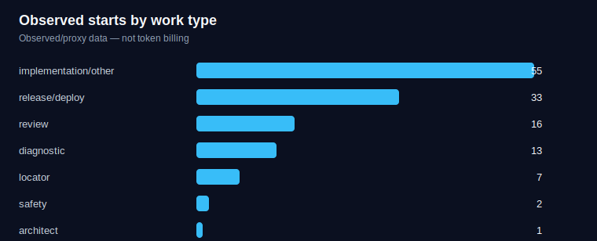
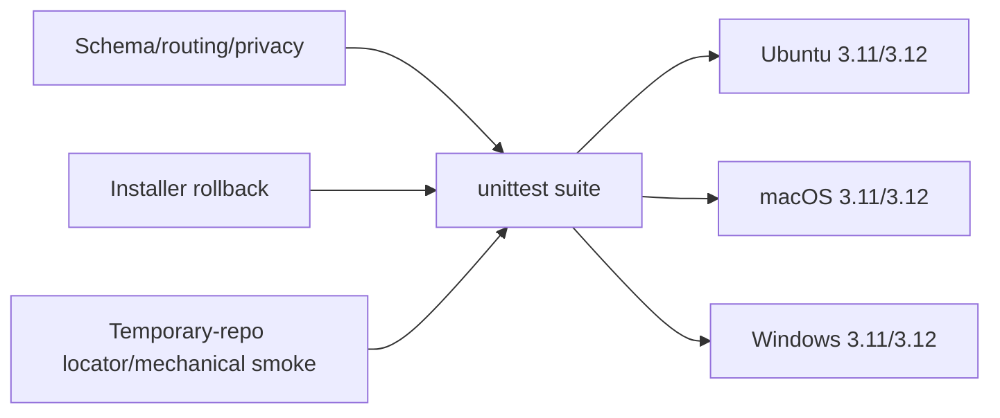

<p align="center"></p>

# Govern Agent System

<p align="center">A portable, fail-closed control plane for disciplined Codex agent work.</p>

<p align="center">  </p>

**[简体中文](README.zh-CN.md)** · **Unofficial, experimental project** — an independent community project, not an OpenAI product or official policy.

The hero is optional presentation artwork; every command and document remains useful if an image renderer cannot load it. This repository turns a fixed, reviewable role catalog into deterministic dispatch, English child contracts, generated adapters, privacy-bounded evidence, and recoverable local installation. Its core never requires MCP or CodeGraph.

## Why this exists

Unguided collaboration repeatedly rereads business files and re-decides scope, sequencing, and risk in every handoff. Here, capable parent/Sol agents retain those high-context responsibilities: scope, frozen contracts, sequencing, and high-risk decisions. Spark performs factual revision/path/line/status lookup; Terra implements settled slices; Sol specialists cover architecture, safety, review, and release. The optional bounded Luna variant only performs exact deterministic transformations and never plans.

| Repeated-reasoning flow | Governed flow |
| --- | --- |
| Re-discover files, ownership, and intent per handoff | Dispatch a frozen contract to one authority-bounded role |
| Transfer broad context and re-plan | Reuse `reuse_key`, progressively load the needed profile, return compact evidence |
| Smaller models must infer business intent | Give them narrow settled contracts and deterministic checks; fail closed/escalate when that is insufficient |

This is designed to reduce repeated rediscovery and context transfer, with the expected mechanism of improving development throughput while compensating for weaker planning in smaller models. The observed 20,462 → 7,055 instruction-byte change is a context-footprint proxy only—not token billing proof, a measured throughput outcome, a quality-trade claim, or a controlled benchmark. Fail-closed routing and escalation are intended to preserve quality boundaries rather than optimize past them.

## Quick start

```bash
git clone https://github.com/Adam0120/codex-agent-governance.git
cd codex-agent-governance
python3 scripts/install.py check
python3 scripts/install.py install
python3 scripts/agent_system.py evaluate --cwd "$PWD"
```

Use `install --link` for development, then `rollback --snapshot <path>` to restore the complete pre-install snapshot. A later `install --link` first verifies the old checkout against its recorded manifest, then atomically repoints the Skill to the incoming checkout; modifying the linked checkout after installation fails ownership verification. Locations resolve canonical platform aliases once from `CODEX_HOME` or `~/.codex`, and `$HOME/.agents/skills`. The installer rejects links at or below those trusted roots, refuses unmanaged collisions, snapshots Skill/adapters/config, atomically installs, safely merges only managed `[agents]` keys, and never touches MCP config.

The canonical Skill identity and destination are `$govern-agent-system` and `$HOME/.agents/skills/govern-agent-system`, independent of the checkout directory name. Installation, standalone rollback, and direct generation share one contained no-follow lock for their complete write batches. A held or stale crash lock fails closed (`INSTALL_LOCKED`) without managed-state mutation. Exact versioned manifests bind canonical destinations and content hashes; an A→B update validates A against A's own recorded provenance before staging B. Rollback validates and stages every restore before promotion. If automatic recovery cannot be verified, its `recovery_failed` journal fences every managed writer before mutation and is rechecked under the shared lock. Only `rollback --recover --snapshot <journal recovery_snapshot>` may clear the fence. Failed retries retain that original known-good snapshot anchor; success verifies every managed destination against it before clearing the journal.

## Architecture



Role semantics and runtime mappings are deliberately separate. The public commands are `audit`, `dispatch`, `profile`, `record`, `evaluate`, `generate`, and `verify`.

## Request routing and state flow



`code_locator` uses Git, `rg` when available with a bounded standard-library fallback, path/permission checks, and bounded reads. CodeGraph is only an optional, non-blocking external enhancement.

## Roles and runtime

| Role | Authority boundary | Default mapping |
| --- | --- | --- |
| `default` | Read-only advisory fallback | Terra / high / read-only |
| `worker` | Settled independent implementation | Terra / high / workspace-write |
| `explorer` | Bounded discovery/triage | Terra / high / read-only |
| `code_locator` | Revision-aware factual locations | Spark / high / read-only |
| `cross_module_architect` | Frozen cross-module decisions | Sol / high / read-only |
| `systems_safety` | Concurrency/lifecycle/crypto/durable state | Sol / high / workspace-write |
| `semantic_reviewer` | Final semantic/security review | Sol / high / read-only |
| `release_operator` | Approved revision-bound activation | Sol / high / workspace-write |

`mechanical_worker` is a strict worker variant, not a ninth role. A generated deployment may map it to `mechanical_luna`; that mapping requires runtime model availability. This host did not live-validate Luna: an isolated `codex exec --model gpt-5.6-luna` probe used fresh HOME/CODEX_HOME, no inherited configuration, no live Skill, and a temporary Git repository, but stopped at API authentication before model execution. It requires a fixed target, no factual uncertainty, every declared safety guard true, and a deterministic check; semantic failure returns `ESCALATE_STANDARD`.

## Trust and safety boundary



Adapters manage exactly `enabled = true`, `max_threads = 4`, and `max_depth = 1`; unrelated `[agents]` keys remain untouched. Child contracts require English, final evidence, and no child spawning. Overlays can only supply identity/base hash, locator inventory/literal qualifiers, evidence directory, and compatibility-mirror requirement.

## Observed proxy data — not token billing

<p align="center"></p>
<p align="center"></p>

| Observation | Result |
| --- | ---: |
| Instruction bytes (observed proxy) | 20,462 → 7,055 |
| Historical field evaluation (observation, not current harness) | 36 / 36 |
| Current public unittest harness | 14 / 14 |
| Fresh-process checks | 4 / 4 |
| Deterministic adapters | 8 / 8 |
| Compact ledger events | 6; 0 sensitive fields |

The locator contract was corrected before a blind first-response pass. [Observations](benchmarks/observations.json) are anonymized proxies/observations, not a controlled benchmark and not token billing. The mechanical-Luna item is an availability limitation, not a live Luna smoke result.

## Tests and compatibility



Run `python3 -m unittest discover -s tests -v`, `python3 scripts/agent_system.py locator-smoke`, and `python3 scripts/render_charts.py`. Optional integrations are opt-in and non-blocking. No external service, cloud account, MCP server, or CodeGraph dependency is needed.

## Contributing and security

Read [CONTRIBUTING.md](CONTRIBUTING.md). Report vulnerabilities through [SECURITY.md](SECURITY.md), not public issues. Never add private paths, credentials, user content, transcripts, or deployment state to fixtures, records, or benchmark data.
