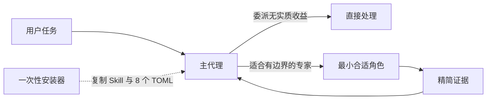

# Govern Agent System

[English](README.md)

实验性 v0.2.3 提供一个精简 Codex Skill 与八个自包含自定义代理，通过 Codex 原生能力进行委派。日常运行不再需要 Python 治理控制器、请求 JSON、生成 profile、复用令牌、ledger 写入、项目 overlay 或强制 MCP 步骤。

## 为什么 v0.2 更简单

Codex 已能选择并启动注册代理。v0.2 把策略直接放在消费位置：

- `SKILL.md` 为高能力主代理提供高自由度的选角与交接指导。
- `.codex/agents/*.toml` 直接打包八个固定角色，并自包含执行、工具、升级、模型、推理强度和 sandbox 契约。
- 项目事实放入各项目的 `AGENTS.md`。
- 安装与回滚复杂度仅属于维护边界，不进入运行时提示词热路径。



## 角色矩阵

| 角色 | 模型 | 推理强度 | Sandbox | 用途 |
|---|---|---|---|---|
| `default` | `gpt-5.6-luna` | high | read-only | 有边界的建议节点 |
| `worker` | `gpt-5.6-luna` | high | workspace-write | 已确定的实现节点 |
| `explorer` | `gpt-5.6-luna` | high | read-only | 有边界的证据收集或排障 |
| `code_locator` | `gpt-5.3-codex-spark` | high | read-only | 感知版本的事实位置 |
| `cross_module_architect` | `gpt-5.6-terra` | medium | read-only | 契约证据与候选方案 |
| `systems_safety` | `gpt-5.6-terra` | medium | workspace-write | 主线程批准的安全不变量或补丁 |
| `semantic_reviewer` | `gpt-5.6-sol` | medium | read-only | 建议性质的语义与安全审查 |
| `release_operator` | `gpt-5.6-terra` | medium | workspace-write | 已授权且绑定版本的运行手册 |

旧的 dispatch 专用 `mechanical_luna` 变体继续保持移除。Luna 直接配置给三个既有常规角色；连续推理失败时把同一角色升级到 Terra，不新增角色。

## 快速开始

先只读检查，再安装；之后重启 Codex 以重新加载自定义代理注册表：

```bash
python3 scripts/install.py check
python3 scripts/install.py install
```

同一套规范安装器也暴露为 `codex-agent-governance` Python 命令。在仓库检出目录中，`uvx --from . codex-agent-governance install` 会在隔离环境中构建并运行它。发行包正式发布后，下面一条命令即可取得最新 CLI 并安装或升级受管运行时：

```bash
uvx codex-agent-governance@latest install
```

若需要持久命令，可使用 `uv tool install codex-agent-governance`；之后先用 `uv tool upgrade codex-agent-governance` 刷新 CLI，再运行 `codex-agent-governance install`。按照 [uv 官方工具指南](https://docs.astral.sh/uv/guides/tools/)，`uvx` 使用临时隔离环境，`uv tool install` 使用持久环境。本仓库现已包含包元数据和 wheel payload，但在真正执行发行前不会声称 PyPI 上已经存在该包。

安装器只把 `SKILL.md` 复制到 `$HOME/.agents/skills/govern-agent-system/`，把恰好八个打包 TOML 复制到 `${CODEX_HOME:-$HOME/.codex}/agents/`，并且只安全合并以下受支持的全局配置：

```toml
[agents]
max_threads = 6
max_depth = 1
```

`~/.codex/agents/` 下的独立自定义代理 TOML 会被原生发现，不需要 `config_file` 声明。受支持的 `[agents]` 表包含 `max_threads`、`max_depth`、`job_max_runtime_seconds` 和 `interrupt_message` 等设置，并不存在 `enabled` 开关。参见当前 [Codex Subagents 文档](https://developers.openai.com/codex/subagents/)。

其他 Codex 配置（包括不相关且受支持的 `[agents]` 键与 MCP 配置）保持不变。六个并发子线程与当前 Codex 默认值一致；`max_depth = 1` 防止递归扩散。调用 `$govern-agent-system` 后，主代理判断委派是否有实质收益，默认只使用一个子代理，为冻结节点选择最小角色、发送精简任务，并在相同工作面后续中按 agent id 复用同一子代理。架构与产品决策、风险接受、集成和最终验收均由主代理负责。拒绝或安全门失败意味着 `STOP`，不是扩大范围或提升权限的理由。

即使用户没有点名，Codex 也应在首次创建或复用原生自定义子代理前加载本 Skill。自动触发覆盖两个及以上独立工作面、多仓或跨模块工作、并行协调、累积审查和发布工作。加载不等于授权委派：主代理仍须通过可派发门槛；没有能带来实质收益的有界专家时应直接处理。

原生委派只是优化手段，不是运行前提。若当前 Codex 表面没有提供原生派发或复用工具，主代理应在既有权限和 writer lease 下直接继续。缺少可选委派能力不得被报告为阻塞、不得反复做能力审计，也不得据此把本来可执行的目标标记为 `blocked`。

自定义代理注册表可能是任务级的。若派发返回 `unknown agent_type`，不要反复重试，也不要据此推断适配器 TOML 无效：将该角色视为当前任务不可用，保留冻结节点并改用直接执行或已注册的最小匹配角色。重启 Codex 后，新的顶层任务会重新加载注册表；既有任务可能继续保留旧角色集合。

派发前必须检查实际的 spawn 参数表。若接口提供 `agent_type`，每次原生派发都必须通过该字段传入已选注册角色；任务名中出现 `worker`、`locator` 或 `review` 并不会绑定适配器。常规已绑定角色派发不直接覆盖 model/effort，并使用 `fork_turns="none"` 或最小的正数历史窗口；省略该字段或使用 `all` 会继承父任务模型与强度。

某些既有任务表面会省略 `agent_type`，但仍提供 `model` 和 `reasoning_effort`。此时进入兼容派发模式，必须显式传入固定档位而非继承父代理：`code_locator` 使用 Spark/high；`default`、`worker`、`explorer` 使用 Luna/high；`cross_module_architect`、`systems_safety`、`release_operator` 使用 Terra/medium；`semantic_reviewer` 使用 Sol/medium。这是兼容例外，不是能力升级。该模式不会加载 TOML sandbox 或 developer profile，因此“只读”只是建议性质；主代理必须保留 writer lease 并核验冻结的拥有范围。若当前接口不支持精确档位，直接处理该节点，不得静默继承或换用更高模型。已运行子代理不能在节点中途重新绑定，应让成熟且范围正确的节点完成，并从下一新节点起采用本规则。这是内部派发纪律，不输出面向用户的绑定遥测。

## 派发纪律

每个委派节点都必须精确到可以独立验证。可派发任务只包含一个可观察状态转换或一个证据问题，并写明唯一负责的仓库/工作树与基线版本、受限的文件/符号白名单（或狭小搜索区）、明确排除项、冻结不变量、单一操作类别，以及聚焦的验收证据。项目背景不是任务范围。

如果任务混合了定位、架构、实现、审查或发布；跨越相互独立的状态机；或把 migration、协议版本、运行时改动和客户端集成捆成一包，必须先拆分。优先采用“定位 → 冻结 → 实现一个节点 → 验证/审查”。一个工作树/文件集只能有一个活跃写入者；只读节点必须使用不可变版本，或在写入者改变证据基线前完成。

除 `code_locator` 外，所有子代理回报必须以 `COMPLETE`、`PARTIAL` 或 `STOP` 收口，并注明检查/修改范围、相关时的结果版本或状态、已执行或未执行的验证、阻塞项及主代理下一步。`code_locator` 则以其精确的 `Lookup` 状态收口。仅当仓库/工作树、基线、目标/不变量、操作类别和拥有范围均未改变时，才复用同一子代理。拒绝、安全门失败、缺少权限或外部阻塞仍然是 `STOP`，不属于能力升级信号；否则，同一子代理连续两次以 `PARTIAL` 或因范围/目标歧义而 `STOP` 时，应先适当缩小拥有范围，和/或明确目标、不变量及预期结果。只有重新设界的任务仍因推理质量失败时，才可提高一个受支持的模型或推理档位。Luna 角色直接升级到 Terra，不新增角色。不得在提高能力的同时扩大任务。最高成本审查只用于已冻结的高风险 diff。

## 安全更新与回滚

### 升级已安装的受管版本

进入 v0.2.3 的仓库检出目录或发行包目录后，使用新版安装器升级；不要手工复制文件覆盖已安装目录：

```bash
python3 scripts/install.py check
python3 scripts/install.py install
```

`install` 可直接替换任何来源已验证且采用当前格式的受管安装，包括跳版本更新，以及记录版本号高于本安装器的来源。版本顺序不是兼容门槛；真正的门槛是精确的 manifest schema、规范目标路径、内容哈希和受管配置来源。替换前会为原有受管 Skill、八个适配器和受管配置创建快照，再以原子方式只替换这些受管文件。记录命令返回的快照路径，然后重启 Codex 以重新加载自定义代理注册表。不要手工覆盖 `$HOME/.agents/skills/govern-agent-system/` 或 `${CODEX_HOME:-$HOME/.codex}/agents/*.toml`。

每次安装都会创建私有快照并返回路径。恢复命令：

```bash
python3 scripts/install.py rollback --snapshot <snapshot-path>
```

要移除已验证的受管安装，同时保留用户自有代理、无关 Codex 配置和 MCP 设置，可运行：

```bash
python3 scripts/install.py uninstall
```

`uninstall` 同样会创建并返回私有回滚快照。它只删除 manifest 能证明归安装器所有的 Skill、八个受管适配器文件、`agents.max_threads`、`agents.max_depth` 和受管 manifest。若后续版本改变 manifest/config schema，当前 CLI 因无法验证而拒绝时，应使用与已安装 schema 兼容的 CLI 执行 `uninstall`，再使用最新 CLI 执行 `install`。安装器绝不会根据未知格式猜测文件所有权。

纯标准库安装器使用受限且禁止跟随链接的锁、冲突检查、内容绑定清单、完整安装前快照、分阶段原子替换、恢复隔离和精确目标回滚。每个替换计划都会在写入前持久化到 journal。已写 journal 的事务若发生中断，下一个 writer 会报告 `RECOVERY_REQUIRED` 及确切的 `rollback --recover --snapshot ...` 命令；显式恢复会在精确还原后清除已记录的事务残留。如果进程死在 journal 创建前或关闭后并留下锁，下一个 writer 只有在证明 owner 已死亡后才会回收该锁；取得替换锁后重新检查 journal，并且只清理保留的 `.govern-agent-system.*` staging 命名空间。活跃或无法证明归属的锁仍然保持隔离。未知受管状态、symlink/reparse point、敏感硬链接、畸形清单、歧义的 dotted `[agents]` 键以及已变更的受管内容都会默认拒绝。在 POSIX 上，状态/快照目录限制为 `0700`，敏感文件为 `0600`。`check` 只读。安装、检查、卸载和回滚均不修改 MCP 配置。

任何使用 v0.2.0 引入的当前格式且来源已验证的受管安装，都可直接更新到 v0.2.3；无论跳过多少版本，也无论来源记录版本号低于、等于或高于本 CLI。兼容性来自精确验证的 manifest/config 格式与来源，而不是固定版本列表或版本顺序。更新会用固定 profile 运行时替换受管 Skill 和八个适配器，同时保留非代理配置、不相关且受支持的 `[agents]` 键、MCP 设置和受管目标外的未知用户文件。v0.2 以前的受管格式以及任何未知 schema 都会默认拒绝且不写入；不再保留 v0.1 迁移路径。v0.2 运行时不会把惰性的旧 ledger 当作遥测读取或写入。更新与卸载快照都可逐字节恢复先前受管状态；v0.2 不提供 `install --link`。

如果无法验证恢复结果，所有受管写入都会继续被隔离。只能使用安装器报告的精确恢复命令与快照，不要手工删除 journal。

## 运行时与维护边界

运行时载荷：

- 一个精简 `SKILL.md`；
- 八个规范、可解析、自包含的自定义代理 TOML；
- 不依赖控制器、生成器、overlay、遥测或 MCP。

维护面：

- `scripts/install.py` 与 `scripts/managed_lock.py` 提供 check/install/uninstall/rollback；
- 测试覆盖格式兼容、卸载、回滚、冲突、恢复、锁、权限、链接/reparse point、硬链接、配置合并和静态运行时契约；
- 公共文档与版本元数据。

代码定位器可仅依赖 Git、可用时的 `rg`、有边界的标准库回退与行号复核。CodeGraph 或其他 MCP 索引是可选、非阻塞能力。适配器可以在相关且宿主已提供时使用 Skill 或 MCP，但既不安装也不要求它们。

## 实验性兼容与证据限制

v0.2.3 面向当前 Codex 自定义代理 TOML 字段，以及由任意具备能力且推理强度为 high 或更高的主模型进行的原生角色绑定派发；用户显式要求使用本 Skill 时也可加载。对省略 `agent_type` 的旧任务表面，使用已记录的显式 profile 兼容路径，而不假称已绑定 TOML 适配器。这些接口可能变化。请先在隔离的 `HOME`/`CODEX_HOME` 中验证，保留安装返回的快照，并在安装后重启 Codex。

本地测试覆盖受支持 Python 版本与 CI 操作系统上的确定性文件系统和配置行为，但不能证明模型质量、成本下降、完成速度提升、CodeGraph 可用性、生产发布安全或真实多代理效果更优。本项目没有受控现场研究或生产部署结论。

## 开发

```bash
python3 -m unittest discover -s tests -v
python3 -m compileall -q scripts src tests
```

运行时和安装后的 CLI 仅使用 Python 标准库；setuptools 与 wheel 只用于构建。参见 [CONTRIBUTING.md](CONTRIBUTING.md) 与 [SECURITY.md](SECURITY.md)。
