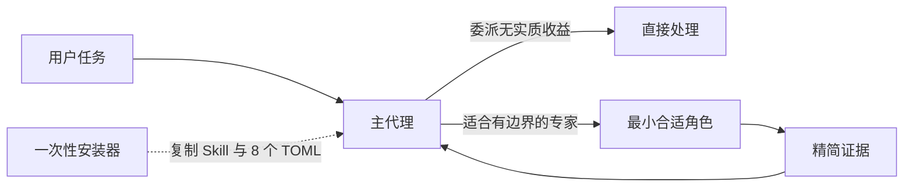

# Govern Agent System

[English](README.md)

实验性 v0.2.1 提供一个精简 Codex Skill 与八个自包含自定义代理，通过 Codex 原生能力进行委派。日常运行不再需要 Python 治理控制器、请求 JSON、生成 profile、复用令牌、ledger 写入、项目 overlay 或强制 MCP 步骤。

## 为什么 v0.2 更简单

Codex 已能选择并启动注册代理。v0.2 把策略直接放在消费位置：

- `SKILL.md` 为高能力主代理提供高自由度的选角与交接指导。
- `.codex/agents/*.toml` 直接打包八个固定角色，并自包含执行、工具、升级、模型、推理强度和 sandbox 契约。
- 项目事实放入各项目的 `AGENTS.md`。
- 安装与回滚复杂度仅属于维护边界，不进入运行时提示词热路径。



## 角色矩阵

| 角色 | 模型 | 推理强度 | Sandbox | 用途 |
|---|---|---|---|---|
| `default` | `gpt-5.6-terra` | medium | read-only | 有边界的建议节点 |
| `worker` | `gpt-5.6-terra` | medium | workspace-write | 已确定的实现节点 |
| `explorer` | `gpt-5.6-terra` | medium | read-only | 有边界的证据收集或排障 |
| `code_locator` | `gpt-5.3-codex-spark` | high | read-only | 感知版本的事实位置 |
| `cross_module_architect` | `gpt-5.6-terra` | medium | read-only | 契约证据与候选方案 |
| `systems_safety` | `gpt-5.6-terra` | medium | workspace-write | 主线程批准的安全不变量或补丁 |
| `semantic_reviewer` | `gpt-5.6-sol` | medium | read-only | 建议性质的语义与安全审查 |
| `release_operator` | `gpt-5.6-terra` | medium | workspace-write | 已授权且绑定版本的运行手册 |

v0.1 中仅用于 dispatch、未验证的 `mechanical_luna` 变体已移除；它从来不是第九个角色。

## 快速开始

先只读检查，再安装；之后重启 Codex 以重新加载自定义代理注册表：

```bash
python3 scripts/install.py check
python3 scripts/install.py install
```

安装器只把 `SKILL.md` 复制到 `$HOME/.agents/skills/govern-agent-system/`，把恰好八个打包 TOML 复制到 `${CODEX_HOME:-$HOME/.codex}/agents/`，并且只安全合并以下受支持的全局配置：

```toml
[agents]
max_threads = 4
max_depth = 1
```

`~/.codex/agents/` 下的独立自定义代理 TOML 会被原生发现，不需要 `config_file` 声明。受支持的 `[agents]` 表包含 `max_threads`、`max_depth`、`job_max_runtime_seconds` 和 `interrupt_message` 等设置，并不存在 `enabled` 开关。参见当前 [Codex Subagents 文档](https://developers.openai.com/codex/subagents/)。

其他 Codex 配置（包括不相关且受支持的 `[agents]` 键与 MCP 配置）保持不变。调用 `$govern-agent-system` 后，主代理判断委派是否有实质收益，默认只使用一个子代理，为冻结节点选择最小角色、发送精简任务，并在相同工作面后续中按 agent id 复用同一子代理。架构与产品决策、风险接受、集成和最终验收均由主代理负责。拒绝或安全门失败意味着 `STOP`，不是扩大范围或提升权限的理由。

## 派发纪律

每个委派节点都必须精确到可以独立验证。可派发任务只包含一个可观察状态转换或一个证据问题，并写明唯一负责的仓库/工作树与基线版本、受限的文件/符号白名单（或狭小搜索区）、明确排除项、冻结不变量、单一操作类别，以及聚焦的验收证据。项目背景不是任务范围。

如果任务混合了定位、架构、实现、审查或发布；跨越相互独立的状态机；或把 migration、协议版本、运行时改动和客户端集成捆成一包，必须先拆分。优先采用“定位 → 冻结 → 实现一个节点 → 验证/审查”。一个工作树/文件集只能有一个活跃写入者；只读节点必须使用不可变版本，或在写入者改变证据基线前完成。

除 `code_locator` 外，所有子代理回报必须以 `COMPLETE`、`PARTIAL` 或 `STOP` 收口，并注明检查/修改范围、相关时的结果版本或状态、已执行或未执行的验证、阻塞项及主代理下一步。`code_locator` 则以其精确的 `Lookup` 状态收口。仅当仓库/工作树、基线、目标/不变量、操作类别和拥有范围均未改变时，才复用同一子代理。先缩小薄弱任务并补齐验收信号，再提升模型能力；只有同一精确节点反复因推理质量失败时才提高一个支持等级，最高成本审查只用于已冻结的高风险 diff。

## 安全更新与回滚

### 升级已安装的受管版本

进入 v0.2.1 的仓库检出目录或发行包目录后，使用新版安装器升级；不要手工复制文件覆盖已安装目录：

```bash
python3 scripts/install.py check
python3 scripts/install.py install
```

`install` 会直接原地更新已验证来源的受管 v0.2.0 安装：先为原有受管 Skill、八个适配器和受管配置创建快照，再以原子方式只替换这些受管文件。记录命令返回的快照路径，然后重启 Codex 以重新加载自定义代理注册表。不要手工覆盖 `$HOME/.agents/skills/govern-agent-system/` 或 `${CODEX_HOME:-$HOME/.codex}/agents/*.toml`。

每次安装都会创建私有快照并返回路径。恢复命令：

```bash
python3 scripts/install.py rollback --snapshot <snapshot-path>
```

纯标准库安装器使用受限且禁止跟随链接的锁、冲突检查、内容绑定清单、完整安装前快照、分阶段原子替换、恢复隔离和精确目标回滚。未知受管状态、symlink/reparse point、敏感硬链接、畸形清单、歧义的 dotted `[agents]` 键以及已变更的受管内容都会默认拒绝。在 POSIX 上，状态/快照目录限制为 `0700`，敏感文件为 `0600`。`check` 只读。安装、检查和回滚均不修改 MCP 配置。

已发布且受管的 v0.2.0 安装在验证其记录来源后可更新至 v0.2.1。更新会用轻量角色矩阵替换受管 Skill 和八个适配器，同时保留非代理配置、不相关且受支持的 `[agents]` 键、MCP 设置和受管目标外的未知用户文件。已发布且受管的 v0.1.0、v0.1.1 与 v0.1.2 复制或链接安装也可直接更新至 v0.2.1；更新会移除控制器/目录产物以及真实 `[agents]` 表中旧安装器拥有的 `enabled = true`，旧 `ledger.jsonl` 字节仍作为惰性数据原样保留。未知版本、无法证明来源或位置有歧义的 `agents.enabled` 会默认拒绝。v0.2 运行时不会将 ledger 作为遥测读取或写入。更新快照会逐字节恢复先前配置；旧链接 Skill 仅作为验证后的迁移输入，因为 v0.2 已不再提供 `install --link`。

如果无法验证恢复结果，所有受管写入都会继续被隔离。只能使用安装器报告的精确恢复命令与快照，不要手工删除 journal。

## 运行时与维护边界

运行时载荷：

- 一个精简 `SKILL.md`；
- 八个规范、可解析、自包含的自定义代理 TOML；
- 不依赖控制器、生成器、overlay、遥测或 MCP。

维护面：

- `scripts/install.py` 与 `scripts/managed_lock.py` 提供 check/install/rollback；
- 测试覆盖迁移、回滚、冲突、恢复、锁、权限、链接/reparse point、硬链接、配置合并和静态运行时契约；
- 公共文档与版本元数据。

代码定位器可仅依赖 Git、可用时的 `rg`、有边界的标准库回退与行号复核。CodeGraph 或其他 MCP 索引是可选、非阻塞能力。适配器可以在相关且宿主已提供时使用 Skill 或 MCP，但既不安装也不要求它们。

## 实验性兼容与证据限制

v0.2.1 面向当前 Codex 自定义代理 TOML 字段，以及由 Sol/Terra high 或更高推理强度主代理执行的原生代理启动。这些接口可能变化。请先在隔离的 `HOME`/`CODEX_HOME` 中验证，保留安装返回的快照，并在安装后重启 Codex。

本地测试覆盖受支持 Python 版本与 CI 操作系统上的确定性文件系统和配置行为，但不能证明模型质量、成本下降、完成速度提升、CodeGraph 可用性、生产发布安全或真实多代理效果更优。本项目没有受控现场研究或生产部署结论。

## 开发

```bash
python3 -m unittest discover -s tests -v
python3 -m compileall -q scripts tests
```

项目仅使用 Python 标准库。参见 [CONTRIBUTING.md](CONTRIBUTING.md) 与 [SECURITY.md](SECURITY.md)。
