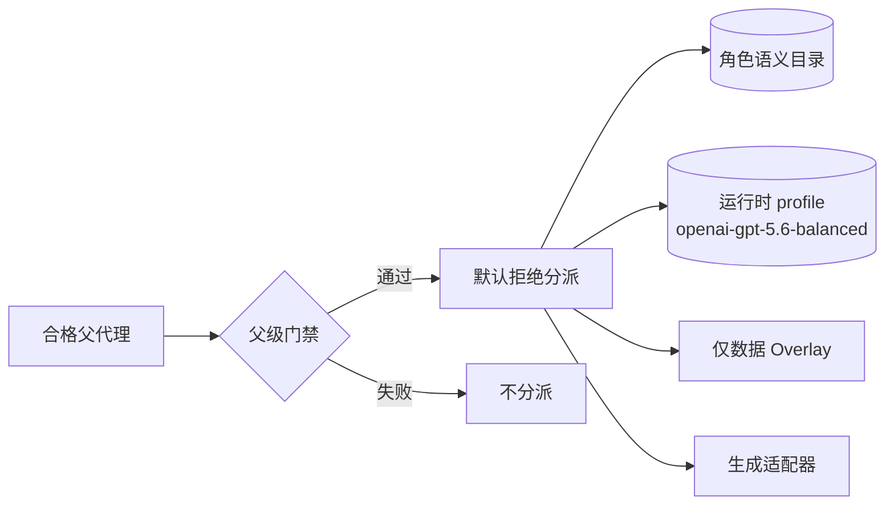
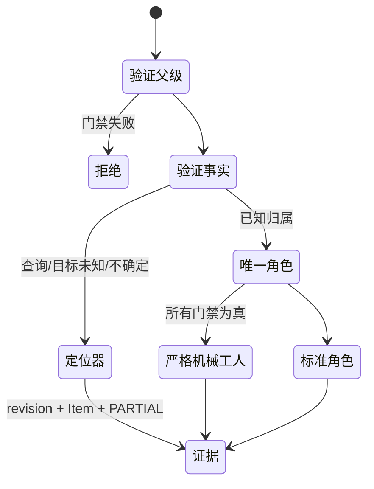

<p align="center"></p>

# Govern Agent System

一个可移植、默认拒绝的 Codex 代理协作控制平面。

**[English](README.md)** · **非官方实验性项目**：独立社区项目，并非 OpenAI 产品或官方政策。即使发布视觉图片无法加载，文档和命令仍然可用。

它通过八角色目录、确定性分派、英文子代理契约、生成式适配器、隐私受限账本和可恢复安装来约束协作；核心不要求 MCP 或 CodeGraph。

## 核心解决的问题

无治理的协作会在每次交接时反复读取业务文件、重新推断范围、顺序与风险。本项目让能力较强的 parent/Sol 保留这些高上下文职责：范围、冻结契约、编排顺序和高风险决策；Spark 负责 revision/path/line/status 的事实定位；Terra 实现已经冻结的切片；Sol 专家负责架构、安全、审查和发布。可选的受限 Luna 变体只处理精确、确定性的转换，绝不负责规划。

| 反复推理流程 | 受治理流程 |
| --- | --- |
| 每次交接重新发现文件、归属与意图 | 向一个权限有界角色分派冻结契约 |
| 传递大段上下文并重新规划 | 复用 `reuse_key`，按需渐进加载 profile，返回紧凑证据 |
| 小模型必须自行推断业务意图 | 提供窄而已冻结的契约和确定性检查；不足时默认拒绝并升级 |

其设计意图是减少重复发现与上下文传递，并以此机制预期改善开发吞吐、通过窄契约弥补较小模型规划能力较弱的问题。观察到的 20,462 → 7,055 指令字节只是上下文占用代理，**不是** token 或账单证明、不是已测得的吞吐结果、不是质量取舍、也不是受控 benchmark。默认拒绝路由和升级机制旨在保住质量边界，而非越过它们。

## 快速开始

```bash
git clone https://github.com/Adam0120/codex-agent-governance.git
cd codex-agent-governance
python3 scripts/install.py install
python3 scripts/agent_system.py evaluate --cwd "$PWD"
```

先运行 `python3 scripts/install.py check`；开发链接安装使用 `python3 scripts/install.py install --link`；再次链接安装会先按旧清单验证旧 checkout，再原子切换到新 checkout，安装后修改旧 checkout 会导致所有权验证失败。使用 `python3 scripts/install.py rollback --snapshot <snapshot>` 恢复安装前完整快照。

位置从 `CODEX_HOME` 或 `~/.codex` 和 `$HOME/.agents/skills` 解析。安装器拒绝未受管理冲突，完整快照 Skill/适配器/配置，原子安装，仅安全合并 `[agents]` 受管理键，绝不修改 MCP 配置。

规范 Skill 身份与目标固定为 `$govern-agent-system` 和 `$HOME/.agents/skills/govern-agent-system`，不依赖 checkout 目录名。HOME 与 CODEX_HOME 的平台别名只规范化一次，并拒绝可信根及其下方的链接或 reparse point。安装、独立回滚和直接生成在完整写入批次内共用一个受限、禁止跟随链接的锁；已有或崩溃遗留的锁会以 `INSTALL_LOCKED` 默认拒绝且不修改受管状态。精确版本清单绑定规范目标和内容哈希；A→B 更新先按 A 自己记录的来源验证 A，再暂存 B。若自动恢复无法验证，`recovery_failed` journal 会阻止所有受管写入，并在取得共享锁后再次检查。只有 `rollback --recover --snapshot <journal 中的 recovery_snapshot>` 才能解除；失败重试始终保留最初的已知良好快照锚点，成功时会按该锚点验证全部受管目标后才清除 journal。

## 架构、路由与安全





`code_locator` 仅使用 Git、优先 `rg`（否则受限标准库回退）、路径/权限检查和有限读取。CodeGraph 仅可作为非阻塞可选增强。Overlay 只能提供身份/base hash、定位器清单和字面限定符、证据目录、兼容镜像标志，不能改变角色、模型、沙箱、工具、深度或策略。

| 角色 | 权限边界 | 默认映射 |
| --- | --- | --- |
| `default` | 只读咨询兜底 | Terra / high / read-only |
| `worker` | 已冻结独立实现 | Terra / high / workspace-write |
| `explorer` | 有界发现/排障 | Terra / high / read-only |
| `code_locator` | 带 revision 的事实定位 | Spark / high / read-only |
| `cross_module_architect` | 跨模块冻结决策 | Sol / high / read-only |
| `systems_safety` | 并发/生命周期/密码/持久状态 | Sol / high / workspace-write |
| `semantic_reviewer` | 最终语义/安全审查 | Sol / high / read-only |
| `release_operator` | 已批准 revision 激活 | Sol / high / workspace-write |

子代理必须使用英文并给出紧凑最终证据，且禁止再派生子代理；生成适配器只管理 `enabled = true`、`max_threads = 4` 与 `max_depth = 1`，保留其他 `[agents]` 键。记录 schema 会拒绝 source、prompt、path、log、credential 等敏感字段。

## 观察代理，不是 token 计费

<p align="center"></p>
<p align="center"></p>

匿名 [观察数据](benchmarks/observations.json)：指令字节代理 20,462 → 7,055；历史现场观察评估 36/36（不是当前公开 harness）；当前公开 unittest 为 14/14；全新进程 4/4；适配器 8/8；六个账本事件、零敏感字段。生成的 `mechanical_luna` 受限变体要求运行时模型可用；本机隔离 CLI 探测在 API 认证阶段停止，未完成 Luna 实机验证或成功 smoke。定位器契约修正在盲测首响应之前完成。这些是观察/代理，不是受控 benchmark，也不是 token 计费。

## 测试与贡献

运行 `python3 -m unittest discover -s tests -v`、`python3 scripts/agent_system.py locator-smoke`、`python3 scripts/render_charts.py`。CI 覆盖 Ubuntu、macOS、Windows 与 Python 3.11/3.12。可选集成为 opt-in 且不阻塞。贡献请读 [CONTRIBUTING.md](CONTRIBUTING.md)，安全问题请按 [SECURITY.md](SECURITY.md) 私下报告；不要提交私有路径、凭据、用户内容、转录或部署状态。
